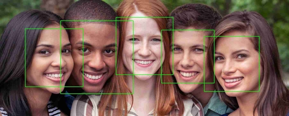

### Nodejs based app with Koa server, Mongodb

[Live Project Link](https://vuemonexpress.herokuapp.com/)  
[Open Source Code](https://github.com/rahbal/koa-web-app)

### TODO app built on Expressjs + Vuejs + MongoDB

[Live Project Link](https://vuemonexpress.herokuapp.com/)  
[Open Source Code](https://github.com/rahbal/VueMonExpress)

### Python based Face Detection app deployed on Heroku

  
[Live Project Link](https://opencv-act.herokuapp.com)  
[Open Source Code](https://github.com/rahbal/opencv-act)

### Solutions to the problems attempted on Competitive Code Sites

[Open Source Code](https://github.com/rahbal/programming-situations)  

***
[**Homepage**](./)
